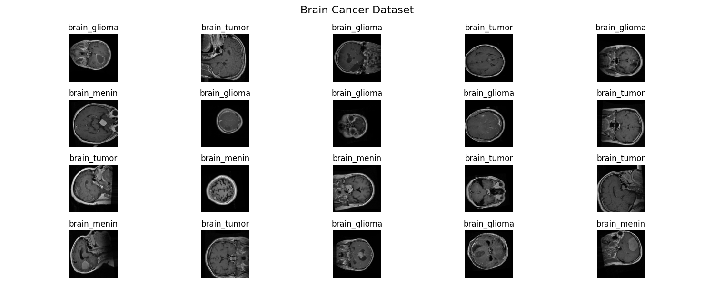
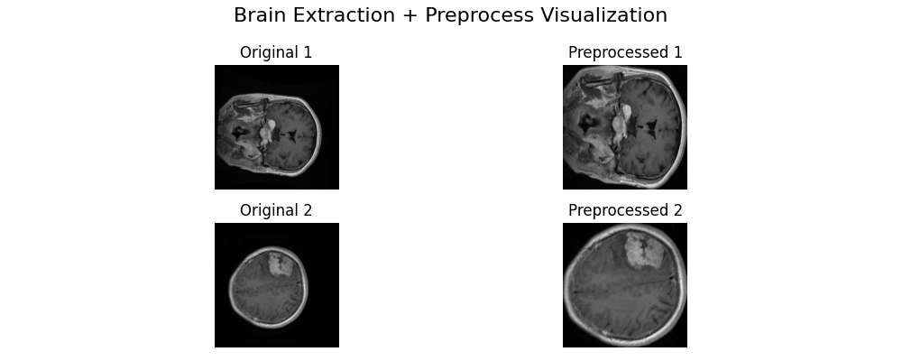
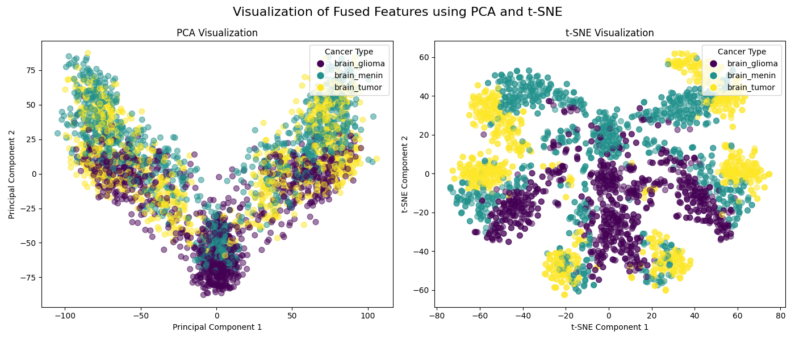
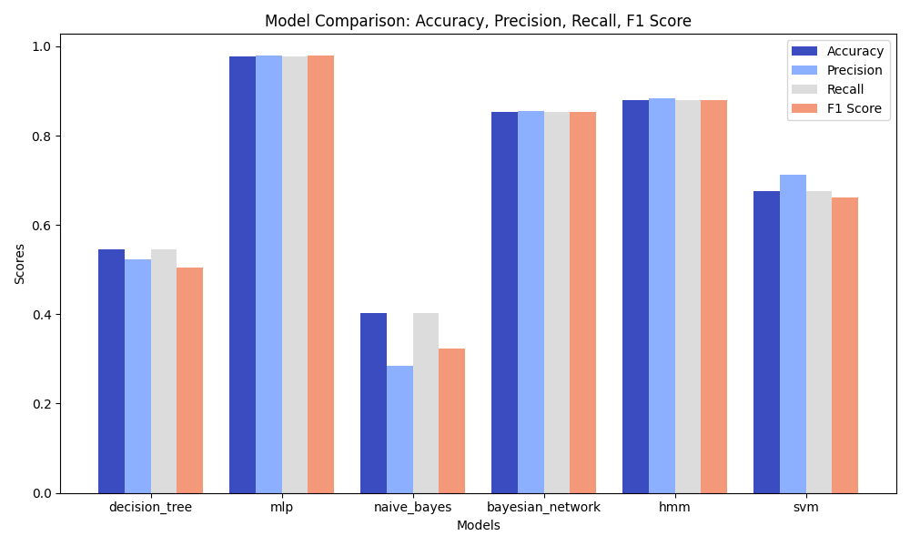

# ML_BarePass Machine Learning Assignment [[Github](https://github.com/ThanhPhan14062003/ML_BarePass)]

This repository contains the implementation of our group Machine Learning assignment, including data preprocessing, model training, evaluation, and analysis.

## Folder Structure

```
ml-course/
├── README.md                   # Project overview, setup instructions, and course info
├── requirements.txt            # Python dependencies
├── .gitignore                 # Specify files/folders to ignore
├── notebooks/                 # Jupyter notebooks for assignments and experiments
│   ├── assignment1/
│   │   ├── exploration.ipynb
│   │   └── submission.ipynb
│   ├── assignment2/
│   └── final_project/
│
├── data/                      # Dataset directory
│   ├── raw/                   # Original, immutable data
│   ├── processed/             # Cleaned and preprocessed data
│   └── external/              # External source data
│
├── src/                       # Source code
│   ├── __init__.py
│   ├── data/                 # Data processing scripts
│   │   ├── __init__.py
│   │   ├── make_dataset.py
│   │   └── preprocess.py
│   │
│   ├── features/             # Feature engineering scripts
│   │   ├── __init__.py
│   │   └── build_features.py
│   │
│   ├── models/               # Model training and prediction scripts
│   │   ├── __init__.py
│   │   ├── train_model.py
│   │   └── predict_model.py
│   │
│   └── visualization/        # Visualization scripts
│       ├── __init__.py
│       └── visualize.py
│
├── models/                    # Saved model files
│   ├── trained/              # Trained model artifacts
│   └── experiments/          # Experimental model versions
│
├── reports/                   # Generated analysis reports
│   ├── figures/              # Generated graphics and figures
│   └── final_project/        # Final project documentation
│
└── tests/                    # Unit tests
    ├── __init__.py
    ├── test_data.py
    └── test_models.py 
```

## Requirements

This project requires Python and several external libraries. The dependencies are listed in `requirements.txt`. Ensure you have Python installed before proceeding.

## Installation

```sh
# Clone the repository
git clone https://github.com/ThanhPhan14062003/ML_BarePass.git
cd ML_BarePass

# Install the required dependencies
conda create --name ml_barepass python=3.9
conda activate ml_barepass
pip install torch torchvision torchaudio --index-url https://download.pytorch.org/whl/cu118
pip install -r requirements.txt
```

## Data Preprocessing

### Overview
The data preprocessing pipeline is designed to refine and enhance MRI images before passing them to machine learning models. It includes steps such as brain region extraction, image normalization, and feature extraction using pre-trained deep learning models.



---

### 1. Brain Contour Extraction
To remove unnecessary background noise and focus on the brain region, we apply an automated contour extraction process:

- **Convert to Grayscale**: MRI images are transformed into grayscale for more efficient processing.
- **Gaussian Blurring**: A smoothing filter is applied to reduce noise and enhance the edges of the brain.
- **Thresholding**: A binary thresholding technique is used to highlight significant structures.
- **Morphological Operations**:
  - **Erosion**: Eliminates small unwanted noise regions.
  - **Dilation**: Strengthens the segmented region for better contour detection.
- **Contour Detection**: The largest contour, which is assumed to correspond to the brain, is identified and cropped.

This step ensures that only relevant brain structures are used for model training, improving performance and reducing computational overhead.

---

### 2. Image Preprocessing
Once the brain region is extracted, additional transformations are applied to prepare the images for feature extraction:

- **Resizing**: All images are resized to **224 × 224 pixels** to match the input dimensions required by deep learning models.
- **Normalization**: Images are normalized with a mean of `[0.5]` and a standard deviation of `[0.5]`.

These preprocessing steps standardize the images, ensuring consistency in model inputs and improving generalization.



---

### 3. Feature Extraction with Pre-Trained Models
After preprocessing, features are extracted using **EfficientNet-B0** and **VGG-19**, two powerful deep learning architectures:

- **EfficientNet-B0**:
  - Extracts high-level semantic features from images using its advanced convolutional layers.
  - Captures hierarchical patterns and textures within the brain region.
- **VGG-19**:
  - Uses deep convolutional layers to learn spatial structures and fine-grained details.
  - Provides robust feature representations for classification.

Each image is processed through both models, and the resulting feature vectors are **concatenated** to form a comprehensive representation. This **feature fusion** approach enhances classification performance by leveraging the strengths of both architectures.




---

### 4. Dataset Processing and Labeling
The dataset consists of MRI images labeled into different categories:

- **brain_glioma** (Label: `0`)
- **brain_menin** (Label: `1`)
- **brain_tumor** (Label: `2`)

Each image's corresponding label is assigned based on the dataset metadata. The extracted features and labels are then stored as structured arrays for downstream model training.

---

### 5. Output Format
After preprocessing, the following outputs are generated:

- **`b0_feature`**: Extracted features from EfficientNet-B0.
- **`vgg_feature`**: Extracted features from VGG-19.
- **`fused_feature`**: Concatenated feature vectors from both models.
- **`labels`**: Ground truth labels corresponding to each image.

These structured outputs serve as inputs for the training phase, facilitating efficient learning and classification.

---

### Summary
The data preprocessing pipeline plays a crucial role in ensuring high-quality inputs for machine learning models. By performing **brain contour extraction, image normalization, and deep feature extraction**, the pipeline enhances model performance and improves classification accuracy. The fusion of EfficientNet-B0 and VGG-19 features further strengthens the ability to distinguish between different brain conditions, making it a robust approach for medical image analysis.


## Model Descriptions

This project implements multiple machine learning models, each with unique characteristics and applications:

### 1. SimpleMLP (Multi-Layer Perceptron)
The **SimpleMLP** is a fully connected neural network that serves as a deep learning baseline. It consists of:
- **Input Layer**: Accepts the input features.
- **Hidden Layer**: A single hidden layer with 128 neurons, using ReLU activation for non-linearity.
- **Output Layer**: A fully connected layer that maps to the number of output classes.
- **Training**: Uses cross-entropy loss and an optimizer (such as Adam or SGD).

### 2. Decision Tree Classifier
The **Decision Tree Model** is a classic non-parametric supervised learning algorithm:
- **Algorithm**: Uses `sklearn.tree.DecisionTreeClassifier` with Gini impurity or entropy as the criterion.
- **Tree Structure**: Recursively splits features to create a hierarchy of decision nodes.
- **Training**: Learns rules based on training samples without requiring feature scaling.
- **Output**: Provides class predictions and probability estimates.

### 3. Naive Bayes Classifier
The **Naive Bayes Model** is a probabilistic classifier based on Bayes' Theorem with an independence assumption:
- **Algorithm**: Uses `sklearn.naive_bayes.GaussianNB`, assuming that feature distributions follow a Gaussian (normal) distribution.
- **Training**: Computes class-conditional probabilities and priors from training data.
- **Output**: Predicts classes based on the highest posterior probability.

### 4. Hidden Markov Model (HMM)
The **HMM Model** is a sequence-based model that learns hidden state transitions:
- **Emission Network**: Uses an MLP to model emission probabilities (likelihood of observing input given a hidden state).
- **Transition Matrix**: A learnable matrix that represents transition probabilities between states.
- **Initial Probabilities**: Learnable start probabilities for sequence initialization.
- **Training**: Uses Negative Log-Likelihood (NLL) loss and optimizes transition/emission parameters.

### 5. Bayesian Network Model
The **Bayesian Network Model** is a probabilistic graphical model that incorporates uncertainty in learning:
- **Bayesian Layers**: Instead of fixed weights, the model learns a distribution over the weights (mean and variance).
- **Reparameterization Trick**: Samples weights from a Gaussian distribution to perform uncertainty estimation.
- **Output**: Produces log-softmax probabilities for classification.
- **Training**: Uses Negative Log-Likelihood (NLL) loss and optimizes both mean and variance of the weights.


## Usage

```sh

notebooks/assignment1/submission.ipynb

```

## Results
**Note**: You might get different results when running the code. We are still trying to fix the results for every user.

This table shows the performance of different models based on accuracy, precision, recall, and F1 score:

| Model            | Accuracy  | Precision  | Recall    | F1        |
|:-----------------|:---------:|:----------:|:---------:|:---------:|
| decision_tree    | 0.545     | 0.522157   | 0.545     | 0.50495   |
| mlp              | 0.978333  | 0.978652   | 0.978333  | 0.97838   |
| naive_bayes      | 0.401667  | 0.28544    | 0.401667  | 0.323378  |
| bayesian_network | 0.853333  | 0.855581   | 0.853333  | 0.853195  |
| hmm              | 0.88      | 0.883947   | 0.88      | 0.880416  |
| svm              | 0.675     | 0.712632   | 0.675     | 0.66111   |



## License

This project is for educational purposes.

